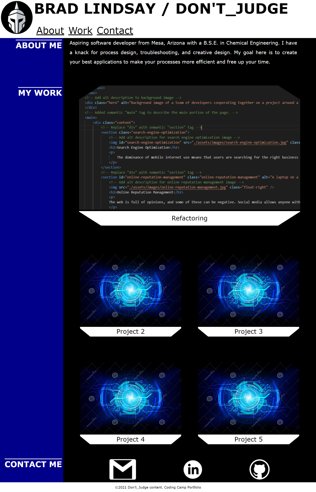

# Brad Lindsay / Don't_Judge Professional Portfolio

## Description

This application runs the Brad Lindsay, A.K.A. Don't_Judge, portfolio page. The navigation components on the nav bar will navigate to the respective section of the page. The top section displays information about the page owner. Below that is the work section. This section displays the various coding applications and projects on the portfolio; each of them are linked to the application itself for easy access and use. Placeholder projects are linked to a Github page to see other projects. Contact information is found at the bottom of the page, including gmail, linkedin, and github links. The application is currently readable on different sized media via direct scaling of the elements. Future updates will further change the layout on smaller media for better visibility. Hopefully, the page will come to be more full as more projects are added and more technologies can be applied.

## Full Portfolio Page

Below is a screenshot of the full portfolio page.

© 2021 Don't_Judge Content

